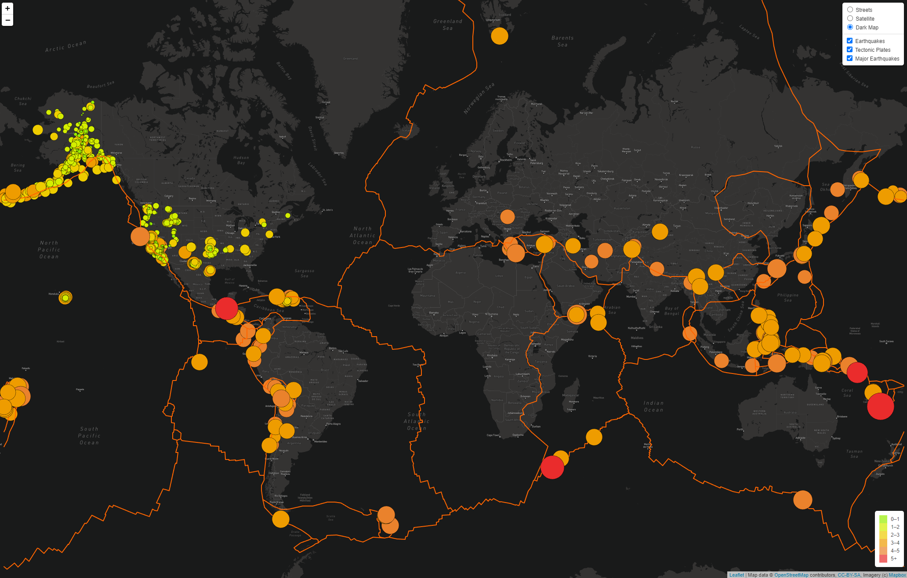

# Mapping_Earthquakes

# Earthquake and Tectonic Plate Visualization

This repository contains a JavaScript project that uses Leaflet.js and D3.js to visualize earthquake data on a world map.

## Project Overview

The script `challenge_logic.js` retrieves and plots earthquake data and tectonic plate boundaries on a map. It allows users to interactively explore recent earthquake activity across the globe and understand the correlation between tectonic plate boundaries and seismic activity.

### Features

1. **Interactive Map**: The map can be zoomed and panned to explore different areas.
2. **Multiple Layers**: The script offers three different base layers (Streets, Satellite, and Dark Map) and overlays to visualize earthquakes, major earthquakes, and tectonic plate boundaries.
3. **GeoJSON Data**: Earthquake data is sourced from the [USGS Earthquake Hazards Program API](https://earthquake.usgs.gov/earthquakes/feed/v1.0/geojson.php). Major earthquakes are filtered for those with a magnitude greater than 4.5. Tectonic plate data is retrieved from the [fraxen/tectonicplates](https://github.com/fraxen/tectonicplates) GitHub repository.
4. **Dynamic Markers**: Earthquakes are represented by circular markers. The color and size of each marker corresponds to the magnitude of the earthquake it represents.
5. **Popup Details**: Clicking on an earthquake marker will display a popup with the earthquake's magnitude and location.
6. **Legend**: A legend in the bottom right of the map provides information about the color coding of earthquake magnitudes.

### Usage

To run the project, open `index.html` in a web browser. You will need to include your own MapBox API key to run this project on your own.
